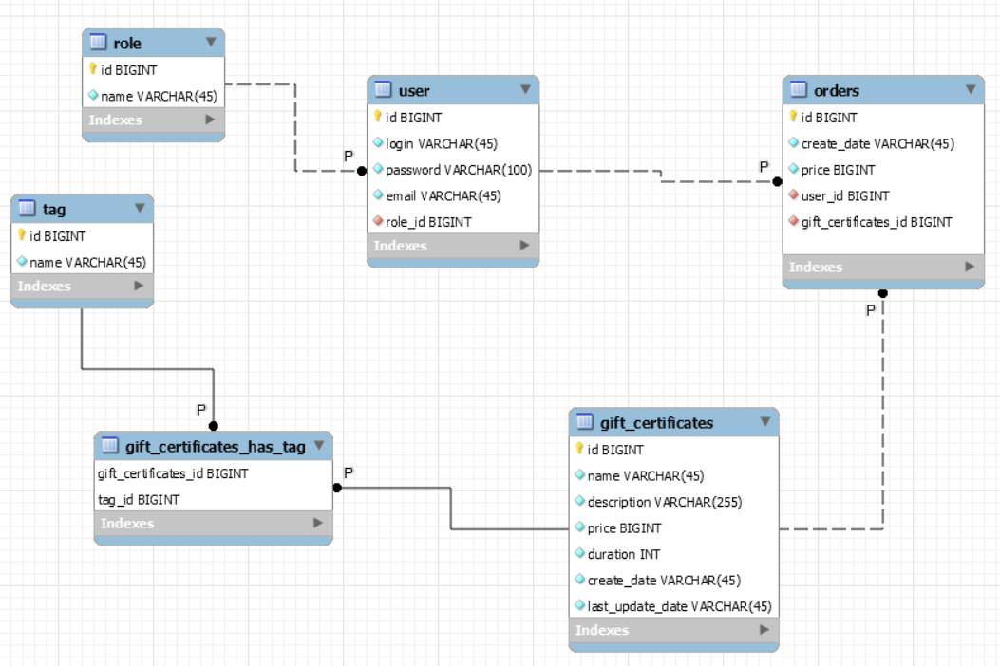

    The full functionality is described here:
https://github.com/mjc-school/MJC-School/blob/old/stage%20%233/java/module%20%232.%20REST%20API%20Basics/rest_api_basics_task.md

## API-docs:
http://localhost:9090/api-docs

## Swagger:
http://localhost:9090/swagger-ui/index.html#/

## Jenkins:
login: davydov
password: admin

## Database Schema:
